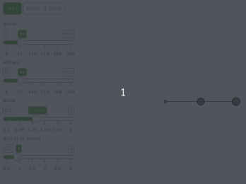

# love2d-double-pendulum

Double pendulum simulation solved using Runge-Kutta method.

Using a library `math-rungekutta` by `peterbillam`.
https://luarocks.org/modules/peterbillam/math-rungekutta

## Running
To run the simulation on linux type `make` in cloned repository. It will automatically download `love` executable.

*Written in [Lua](https://www.lua.org/) using awesome [love2d](https://love2d.org/) framework.*

